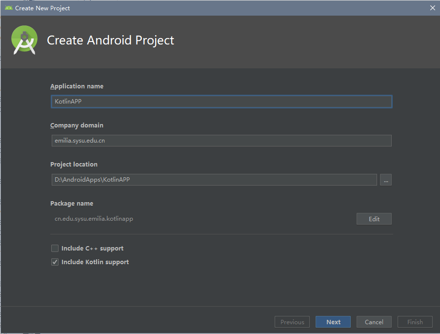

在 Android 项目中使用 Kotlin
===

<!-- TOC -->

- [创建一个 Kotlin Android 项目！](#创建一个-kotlin-android-项目)
- [Kotlin！各种意义上的方便！](#kotlin各种意义上的方便)
    - [View Binding！](#view-binding)
    - [Constriant Transition！](#constriant-transition)
    - [“auto”](#auto)

<!-- /TOC -->

本文假设您使用的是 Android Studio 3.x 进行 Android 开发，并且已经了解了 Kotlin 的相关语法和特性。

## 创建一个 Kotlin Android 项目！

我们平时直接创建的 Android 项目似乎都是各种 .java 文件组成的，要如何创建一个 Kotlin Android 项目呢？很简单~只需要在新建项目时勾选 include Kotlin support 即可！



其余设置皆遵从默认设置即可。如果是老版本的 Android Studio，可能并没有上面的选项。这种情况下需要从 java 文件手动转换到 kt文件，并且配置 Kotlin 的相关环境。

等待 Gradle 为我们配置好项目后，你就可以在虚拟机/自己的手机上试试这个 Kotlin 的 Android Hello World 了！真不愧是谷歌官方支持的 Kotlin 呢！这个 APP 看起来——完全和 JAVA 写的完全没有区别啊！（Kotlin 带来的更多是编程上的便利，毕竟这玩意最后还是编译成 JAVA 字节码……）

## Kotlin！各种意义上的方便！

花那么大力气学了 Kotlin 之后……这不是跟 JAVA 编程没什么两样吗……感觉心血都白费了唔……

NO NO NO！Kotlin 将会给你带来焕然一新的开发体验！让我们来看看它都有哪些方便的地方吧！

### View Binding！

如果你曾经用 JAVA 开发过 Android 项目，`findViewById()` 一定是你再熟悉不过的方法了。但是你有没有一次感到……这个方法就和 WEB 开发里的 `getElementByID()` 一样蠢啊！鬼才知道 get 到的到底是个什么东西啊！还得强制转换类型才能用啊！

咳咳……所以我们可爱的 Kotlin 进化出了一个超便利的方法——View Binding！它能让你直接把 `id` 当成变量名用！这么便利的功能只需要一行代码：

```Kotlin
import kotlinx.android.synthetic.main.activity_main.*
```

这行代码的作用想必你已经猜到了~它把整个 `activity_main` 布局中的 View 全部 `import` 进来！然后我就能简单地通过 `id` 访问 View 啦！比如：

```Kotlin
textView.setText("No more findViewById()!!!")
```

### Constriant Transition！

要说到当初为什么想学 Kotlin，就是因为这该死的 Constriant Transition 啊！这个小东西允许我们很简单地创建一个 Keyframe Animation，在 Kotlin 下，它只需要四行代码！

```Kotlin
val constraintSet = ConstraintSet()
constraintSet.load(this, R.layout.keyframe_two)
TransitionManager.beginDelayedTransition();]
constraintLayout.apply(constraintSet)
```

他所做的，就是通过大小缩放、位置变化，让一个 layout 下的 View 位置转换到另一个 layout 下。至于 JAVA 怎么搞定这事……我至今也没搞明白……

### “auto”

相信每一个用过 C++11 的人都对一个东西心心念念：`auto`。在很多大型项目中，`auto` 的存在令我们不必再去重复那些冗长的类名。而 JAVA 则无情地把它阉割了……

好消息是，Kotlin 的 var 和 val 完美地再现了 `auto` 的功能~代码从此变得清爽啦！

所以你还在等什么，快点加入 Kotlin Android 的行列吧！